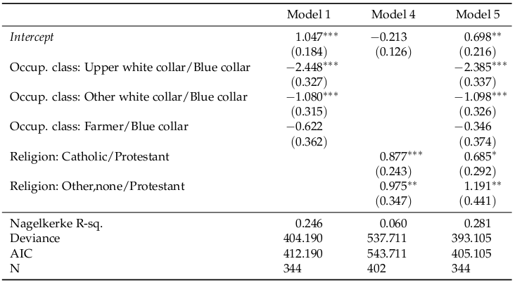
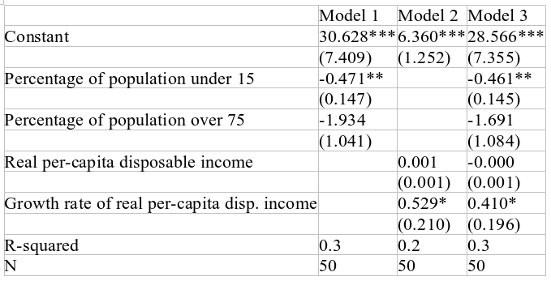
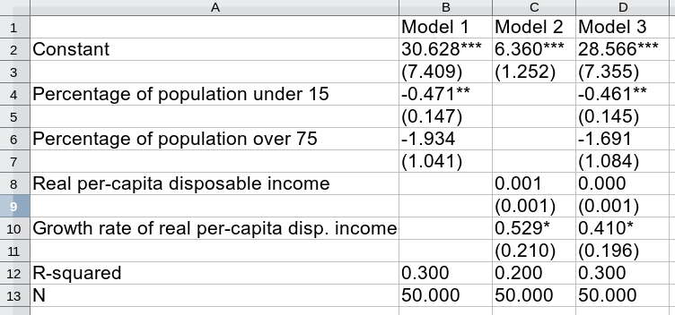
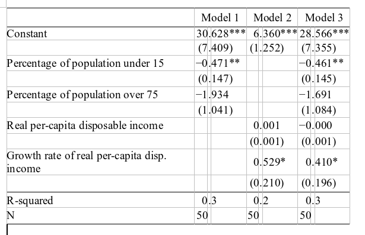
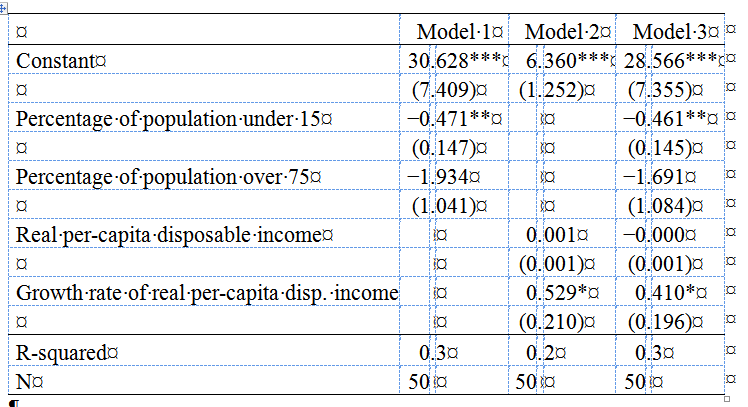

%\VignetteEngine{knitr::rmarkdown}
% \VignetteIndexEntry{Creating tables of model estimates with "mtable"}

```{r,echo=FALSE,message=FALSE}
knitr::opts_chunk$set(comment=NA,
               fig.path="files/",
               fig.align="center",
               fig.retina=2,
               dpi=72,
               results="markup")
```

# The "mtable" function

In conjunction with LaTeX, the output of the `mtable()` function of the package can produce output as can be seen in the following screenshot:
<div class="original-width" style="text-align:center;">

</div>

```{r setup, echo=FALSE,message=FALSE}
library(memisc)
options(digits=3)
nes1948.por <- unzip(system.file("anes/NES1948.ZIP",package="memisc"),
                     "NES1948.POR",exdir=tempfile())
nes1948 <- spss.portable.file(nes1948.por)
vote.48 <- subset(nes1948,
                  select=c(
                    vote           = v480018,
                    occupation.hh  = v480029,
                    unionized.hh   = v480030,
                    gender         = v480045,
                    race           = v480046,
                    age            = v480047,
                    education      = v480048,
                    total.income   = v480049,
                    religious.pref = v480050
                  ))
vote.48 <- within(vote.48,{
  vote3 <- recode(vote,
    1 -> "Truman",
    2 -> "Dewey",
    3:4 -> "Other"
    )
  occup4 <- recode(occupation.hh,
    10:20 -> "Upper white collar",
    30 -> "Other white collar",
    40:70 -> "Blue collar",
    80 -> "Farmer"
    )
  relig3 <- recode(religious.pref,
    1 -> "Protestant",
    2 -> "Catholic",
    3:5 -> "Other,none"
    )
   race2 <- recode(race,
    1 -> "White",
    2 -> "Black"
    )
  })
```

This LaTeX output was generated by the following code:

```{r}
# First a couple of models are run:
model1 <- glm((vote3=="Truman")~occup4,data=vote.48,
              family="binomial")
model2 <- glm((vote3=="Truman")~total.income,data=vote.48,
              family="binomial")
model3 <- glm((vote3=="Truman")~occup4+total.income,data=vote.48,
              family="binomial")
model4 <- glm((vote3=="Truman")~relig3,data=vote.48,
              family="binomial")
model5 <- glm((vote3=="Truman")~occup4+relig3,data=vote.48,
              family="binomial")
```
```{r, eval=FALSE}
# then an mtable object is produced, relabelled and converted
# to LaTeX:
mt145 <- mtable("Model 1"=model1,
              "Model 4"=model4,
              "Model 5"=model5,
              summary.stats=c("Nagelkerke R-sq.","Deviance","AIC","N")
         ) 
mt145 <- relabel(mt145,
                 "[(]Intercept[)]"="\\\\emph{Intercept}",
                 occup4="Occup. class",
                 relig3="Religion",
                 gsub=TRUE)
ltx.m145 <- toLatex(mt145,ddigits=5)
writeLines(ltx.m145,
           con="somewhere/mt145.tex")
```
  
Creating of this output involves the following steps: *First*, `mtable()` is called
```{r}
mt145 <- mtable("Model 1"=model1,
              "Model 4"=model4,
              "Model 5"=model5,
              summary.stats=c("Nagelkerke R-sq.","Deviance","AIC","N")
         ) 
```
 
The resulting object, if printed to the R-console, looks like so:
```{r}
print(mt145)
```


*Second*, the result of `mtable()` is "embellished" using a call to `relabel()`:
```{r}
mt145 <- relabel(mt145,
                 "[(]Intercept[)]"="\\\\emph{Intercept}",
                 occup4="Occup. class",
                 relig3="Religion",
                 gsub=TRUE)
```
*Third*, the relabelled objected is converted into LaTeX and written to a file:
```{r,eval=FALSE}
ltx.m145 <- toLatex(mt145,ddigits=5)
writeLines(ltx.m145,
           con="somewhere/mt145.tex")
```


`mtable()` can also be used to generate HTML-formatted tables of estimates that can be included into word-processor software such as LibreOffice or MS-Word. 
```{r, eval=FALSE}
# We get rid of the LaTeX formatting ...
mt145 <- relabel(mt145,
                 "\\emph{Intercept}"="<em>Intercept</em>",
                 fixed=TRUE)
show_html(mt145)
```
```{r, echo=FALSE,results="asis"}
mt145 <- relabel(mt145,
                 "\\emph{Intercept}"="<em>Intercept</em>",
                 fixed=TRUE)
show_html(mt145)
```

# Choosing what information is presented in the table and how {#displopt}

`mtable()` allows to determine what and how additional information accompanies
(coefficient) estimates in model tables, i.e. whether

  - standard errors
  - p-values
  - symbols for statistical significance (for regression astrologists)
    or
  - confidence intervals 
  
are displayed and whether additional information

  - appears below estimates 
  - or to their right.
   
Further `mtable()` allows to specify which summary statistics are shown. In general,
the way model estimated are represented can be further customized as described further below.

## Estimates, standard errors, confidence intervals etc. {#standard-errors-confidence-intervals}

```{r,include=FALSE}
knit_print.mtable <-function(x,...)
   knitr::asis_output(format_html(x))
```


The chief method to determine how coefficient estmates are shown and what and how additional 
information is provided is by using the `coef.style=` argument of `mtable` with which 
a pre-defined or user-provided template is selected. To demonstrate this, we start with 
the 'standard' way in which coefficient estimates are presented:
```{r}
library(memisc)
lm0 <- lm(sr ~ pop15 + pop75,              data = LifeCycleSavings)
lm1 <- lm(sr ~                 dpi + ddpi, data = LifeCycleSavings)
lm2 <- lm(sr ~ pop15 + pop75 + dpi + ddpi, data = LifeCycleSavings)

mtable("Model 1"=lm0,"Model 2"=lm1,"Model 3"=lm2,
        summary.stats=c("R-squared","N"))
```
We now require Wald-statistics instead of standard errors:
```{r}
mtable("Model 1"=lm0,"Model 2"=lm1,"Model 3"=lm2,
       coef.style="stat",
       summary.stats=c("R-squared","N"))
```
then confidence intervals below estimates
```{r}
mtable("Model 1"=lm0,"Model 2"=lm1,"Model 3"=lm2,
       coef.style="ci",
       summary.stats=c("R-squared","N"))
```
confidence intervals to the right
```{r}
mtable("Model 1"=lm0,"Model 2"=lm1,"Model 3"=lm2,
       coef.style="ci.horizontal",
       summary.stats=c("R-squared","N"))
```
confidence intervals *and* standard errors  
```{r}
mtable("Model 1"=lm0,"Model 2"=lm1,"Model 3"=lm2,
       coef.style="ci.se.horizontal",
       summary.stats=c("R-squared","N"))
```
It is also possible to change the symbols for the significance levels:
```{r}
# Why would one want to have letters instead? I have no idea, but
# some Germen authors/editors seem to like it that way ...
mtable("Model 1"=lm0,"Model 2"=lm1,"Model 3"=lm2,
       signif.symbols=c("<sup>a</sup>"=.05,
                        "<sup>b</sup>"=.01,
                        "<sup>c</sup>"=.001),
       summary.stats=c("R-squared","N"))
```

## Summary statistics
In general there is a certain variety of summary statistics available in `mtable()`. What
statistics these are depends on the statistical model in question and the 
facilities provided by the corresponding `getSummary()` method (see below). If
`mtable()` is called without the `summary.stats=` argument *all* available summary statistics
are shown:
```{r}
mtable("Model 1"=lm0,"Model 2"=lm1,"Model 3"=lm2)
```
So if we prefer (or our reviewer, editor, supervisor or boss) we can show some unusual 
statistics
```{r}
mtable("Model 1"=lm0,"Model 2"=lm1,"Model 3"=lm2,
       summary.stats=c("sigma","BIC","N"))
```

For more examples regarding the content of the results of `mtable()` refer to 
the example code in the help page given by `?mable`.

# Exporting mtable results

```{r,include=FALSE}
knit_print.mtable <-function(x,...)
   print(x)
```


Of course you would not only like to see your table of estimates on screen but
also to include it into a documement that reports your findings. `memisc()` supports
exporting tables of model estimates (i.e. results of `mtable()`) 
into *LaTeX* documents and into formats that
can be read in by word-processing software: *tab-delimited* format and *HTML*.
There is no direct way to export model tables into a word-processing format yet,
mainly because there is no (simple) file format standard (*OpenDocument* may be an
emerging standard, but it is not easy to create files in this format - at least not as easy
as HTML). These various options of exporting the results of `mtable()` are discussed in the 
following. To this purpose, we return to the example from above and 'embellish' a bit
by changing the coefficient labels:
```{r}
lm0 <- lm(sr ~ pop15 + pop75,              data = LifeCycleSavings)
lm1 <- lm(sr ~                 dpi + ddpi, data = LifeCycleSavings)
lm2 <- lm(sr ~ pop15 + pop75 + dpi + ddpi, data = LifeCycleSavings)

mt123 <- mtable("Model 1"=lm0,"Model 2"=lm1,"Model 3"=lm2,
        summary.stats=c("R-squared","N"))
mt123 <- relabel(mt123,
                      "(Intercept)" = "Constant",
                      pop15 = "Percentage of population under 15",
                      pop75 = "Percentage of population over 75",
                      dpi = "Real per-capita disposable income",
                      ddpi = "Growth rate of real per-capita disp. income"
)
mt123
```


## LaTeX Format

The first format to export `mtable()` results into is *TeX/LaTeX* simply because this
is the format in which the author of this package usually writes his papers. This is
achieved by, first, applying the function `toLatex()` to the results of `mtable()`,
which tranlates them into a character string containing *TeX/LaTeX* code and, second,
using `writeLines()` to send this character string into a text file. 
This was already shown at the beginning, but we take a closer look at it here.
Continuing the example immediately above, we call `toLatex()` to see the *TeX/LaTeX* code:
```{r}
toLatex(mt123)
```

It should be noted that `toLatex()` is a generic function and the "memisc"
package 'only' defines a method for "mtable" objects. Alternatively
one could use the call
```{r,eval=FALSE}
format(mt123,target="LaTeX")
```
or even call the internal formatting function itself:
```{r,eval=FALSE}
mtable_format_latex(m123)
```

By default, the TeX/LaTeX code created this way
uses the macros `\toprule`, `\midrule`, and `\bottomrule`
provided by the LaTeX package "booktabs". If you do not like this
package (why shouldn't anyone?) you can resolve this dependency
by calling `toLatex()`, `format()`, or `mtable_format_latex()` with the optional argument 
`useBooktabs=FALSE`. Another default dependency is the LaTeX package "dcolumn",
which is used to make sure that floating point numbers are aligned on their decimal dots.
This dependency can be resolved by the optional argument `useDcolumn=FALSE`.
For more aspects of LaTeX output that can be customized see 
the help page `?mtable_format_latex`.

Until version 0.97 of "memisc", creating a text file with TeX/LaTeX code had to 
be done in two steps, first creating a text string with the code and then
writing the text string into the file. Since version 0.98 both steps can be done
with a single function call, using `write.mtable()`. That is, to write
the LaTeX formatted `mtable()` result in `mt123` one can simple call:
```{r,eval=FALSE}
write.mtable(mt123,format="LaTeX",
             file="mt123.tex")
```


## Text file format (tab-delimited and "CSV")

Tab-delimited format is of course best-suited for exporting data frames
or matrices into files, but since the results of `mtable()` have a tabular
structure, they can also be exported into this format. Tab-delimited format
is quite simple and can be read by a wide variety of software. However, 
this simplicity also means that only the cell contents are
exported while embellishments of the contents (e.g. horizonal alignment of
cells and cell borders) are not.

The following code exports the `mtable()` result named `mt123` into
a text file in tab-delimited format:
```{r}
write.mtable(mt123,file="mt123.txt")
```
After opening this file with LibreWriter, using its "covert text into table" tool, and
some manual tweaking the result looks like this:
<div align="center">

</div>
(The original text file is available [here](mt123.txt) 
while the LibreOffice file is available [here](mt123-tabdelim.odt).)
Obviously some further tweaking (such as comma-oriented column tabulators) is needed
to make this work in a publication.

It is also posslibe export an `mtable()` result into "CSV" format and
import it into some spreadsheet software. This would be done so:
```{r}
write.mtable(mt123,file="mt123.csv",colsep=",")
```
After opening this file with LibreCalc and some tweaking of the format, the result looks
like this:
<div align="center">

</div>
([Here](mt123.csv) is the original CSV file.)

## HTML (for web-pages, knitr reports and word processors)


Of course, having to tweak the format of `mtable()` results by hand is frustrating, so in order to
make easier to get well-formatted tables, version 0.98 of "memisc" provides for exporting
the results of `mtable()` into HTML. HTML is the format of websites, but it can also 
imported into contemporary word processing software with little loss in formatting.
Further, if one is using the "Rmarkdown" and "knitr" packages to produced HTML-formatted reports,
it is convenient to have HTML versions of `mtable()` results.

To get a file in HTML format that contains the results of `mtable()` one can again 
use the function `write.mtable()`, yet in this case with the option `format="HTML"`,
or directly the function `write_html()`:
```{r,eval=FALSE}
write_html(mt123,file="mt123.html")
```
The file "mt123.html" generated that way can be included into your favourite word-processing
software, e.g. LibreOffice. This is how the table would look like after including it into
LibreOffece (and setting the columns to "optimal width"):
<div align="center">

</div>
and this how it would look like after including into Word:
<div align="center">

</div>

To view results of `mtable()` in HTML in interactive sessions with 
RStudio, one can simply call `show_html()` as in 
```{r,eval=FALSE}
show_html(mt123)
```
Of course, this document is not an interactive sesssion but produced using
the "knitr" package. In this context, `show_html()` used inside an R-chunk
with chunk option `results='asis'`.
One could even make sure that if a result of `mtable()` is to appear in a knitr document
then the HTML format is used by the following code:
```{r}
knit_print.mtable <-function(x,...)
   knitr::asis_output(format_html(x))
```
This "trick" was used [previously in this document](#displopt) where the different display options
of coefficient estmates were discussed. Thus after this trick, in a knitr document we get
```{r}
mt123
```


# Adapting mtable to new model classes and other tricks - the API of mtable

`mtable()` is designed to be easily adapted to all kind of model classes: If there
is a model class like, say, "modcls" then all that is needed to get `mtable()` to 
report estimates of instances of this model class is to define a function
`getSummary.modcls()`, i.e. a method function of objects of 
class "modcls". This function needs to return a list with 
components

- "coef":   A matrix or array with coefficients and additional information.
     The rows should refer to coefficients, the columns should contain the 
     estimates, standard errors, p-values, lower and upper confidence interval
     limits. The columns should be labelled "est", "se", "stat", "p", "lwr", and "upr".
     
     For single-equation models, this component should be a matrix. For multiple-equation
     models, it should be a three-dimensional array, with the third dimension corresponding
     to the equations.
- "sumstat": A vector (with named elements) containing model summary statistics, such 
     goodness-of-fit statistics etc.
- "contrasts": A list of the contrast functions, their names, or contrast matrices; 
               one for each (ordered or unordered) factors present in the model.
- "xlevels":   A list with the names of the levels of the factors present in the model.
- "call":  A language object describing the call that created the model estimates.

To illustrate, here are the results of the method function `getSummary.glm()`
(which is called when the generic function `getSummary()` is applied to 
an object of class "glm"):
```{r}
# Model from the first example at the beginning ...
model1 <- glm((vote3=="Truman")~occup4,data=vote.48,
              family="binomial")
getSummary(model1) # or getSummary.glm(model1)
```
The definition of this function is available in [here](getSummary-glm.R) and can be used as a starting
point for other such method functions.

## A demonstration: "mtable" and sandwich estimators of variance

The modularity of `mtable()` through the use of the generic `getSummary()` function allows
other kinds of extensions, e.g. adapting it to the use of "sandwich" estimators of standard errors.
This can be achieved, first, by defining yet another method function of `getSummary()`, e.g. the one defined
in the  *R* available [here](getSummary-glm-sandwich.R). As a second step, one marks
model estimation results such that this newly defined method function is applied to them
by attaching the appropriate class attribute.
For example to get sandwich estimators of standard errors for "lm"" or "glm"" objects
one can attach the classes "lm_sandwich" or "glm_sandwich", respectively, as in the following 
example:
```{r,message=FALSE}
library(memisc)
library(sandwich)
library(lmtest)
source("getSummary-glm-sandwich.R")

data(Mandible)
fm1 <- lm(length ~ age, data=Mandible, subset=(age <= 28))
fm1.sw <- fm1
class(fm1.sw) <- c("lm_sandwich",class(fm1))

mtable(
  "Conventional"=fm1,
  "Sandwich"=fm1.sw,
  summary.stats=c("R-squared","N"))
```

Alternatively, one can use an appropriate `getSummary=` argument to `mtable()` like in this
example:
```{r}
fm1 <- lm(length ~ age, data=Mandible, subset=(age <= 28))
fm2 <- lm(length ~ age+I(scale(age)^2), data=Mandible, subset=(age <= 28))
# Using 'conventional' i.e. model-based standard errors:
mtable(fm1,fm2,summary.stats=c("R-squared","N"))

# Using sandwich-based standard errors:
mtable(fm1,fm2,
       summary.stats=c("R-squared","N"),
       getSummary=getSummary.lm_sandwich)
```
Since version 0.98 of "memisc" we can also put mtable results together etc.
```{r}
mtfm12.conv <- mtable("Model 1"=fm1,
                      "Model 2"=fm2,
                      summary.stats=c("R-squared","N"))
mtfm12.sndw <- mtable("Model 1"=fm1,
                      "Model 2"=fm2,
                      summary.stats=c("R-squared","N"),
                      getSummary=getSummary.lm_sandwich)
c(Conventional=mtfm12.conv,Sandwich=mtfm12.sndw)
```

```{r,echo=FALSE}
rm(knit_print.mtable)
```